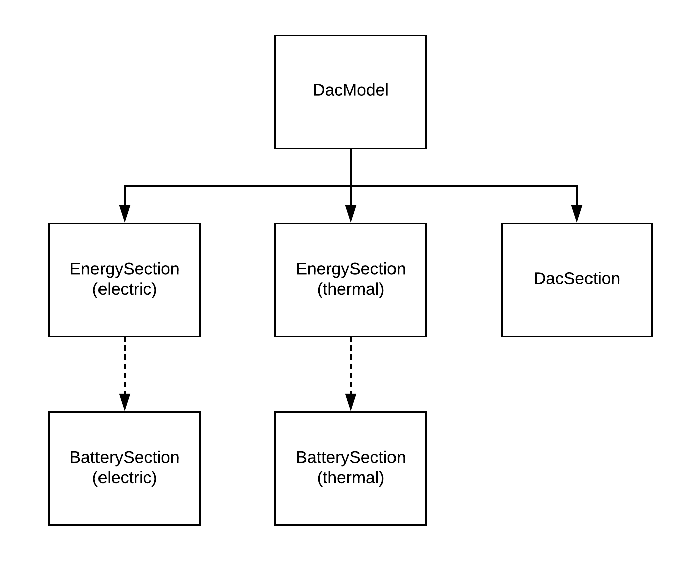

<p align="left" >
<a href='https://carbonplan.org'>
<picture>
  <source media="(prefers-color-scheme: dark)" srcset="https://carbonplan-assets.s3.amazonaws.com/monogram/light-small.png">
  
</picture>
</a>
</p>

# carbonplan / dac-costing

**direct air capture + energy cost analysis**

[](https://github.com/carbonplan/dac-costing/actions/workflows/main.yaml)
[](https://opensource.org/licenses/MIT)

A python module for estimating the cost of building and operating direct air capture facilities. Try it on Binder: [](https://mybinder.org/v2/gh/carbonplan/dac-costing/master)

## Documentation

This repository contains a simple Python module for analyzing various Direct Air
Capture configurations in terms of their energy and fiscal requirements.

### The `dac_costing` package

The `dac_costing` package includes two modules, `model` and `widget`.

The `model` module includes component classes that can be used to create various DAC scenarios.



#### Classes

- `BatterySection`: class for representing battery requirements
- `EnergySection`: class for representing the electric or thermal requirements of a system
- `DacSection`: class for representing the DAC facility (without its energy requirements)
- `DacModel`: class for representing the full/composite DAC system

#### Example usage

```python
params['Base Energy Requierement [MW]'] = 38
ebattery = BatterySection(**params)
electric = EnergySection('Solar', battery=ebattery, **params)

params['Base Energy Requierement [MW]'] = 234
tbattery = BatterySection(**params)
thermal = EnergySection('Solar', battery=tbattery, **params)

params['Total Capex [$]'] = 936.01
dac = DacSection(**params)

dac_all = DacModel(electric, thermal, dac, **params)
dac_all.compute().series
```

### Installing

```shell
pip install git+git://github.com/carbonplan/dac-costing@master
```

## license

All the code in this repository is [MIT](https://choosealicense.com/licenses/mit/)-licensed, but we request that you please provide attribution if reusing any of our digital content (graphics, logo, reports, etc.). Some of the data featured here is sourced from content made available under a [CC-BY-4.0](https://choosealicense.com/licenses/cc-by-4.0/) license. We include attribution for this content, and we please request that you also maintain that attribution if using this data.

## about us

CarbonPlan is a nonprofit organization that uses data and science for climate action. We aim to improve the transparency and scientific integrity of climate solutions with open data and tools. Find out more at [carbonplan.org](https://carbonplan.org/) or get in touch by [opening an issue](https://github.com/carbonplan/cdr-database/issues/new) or [sending us an email](mailto:hello@carbonplan.org).
